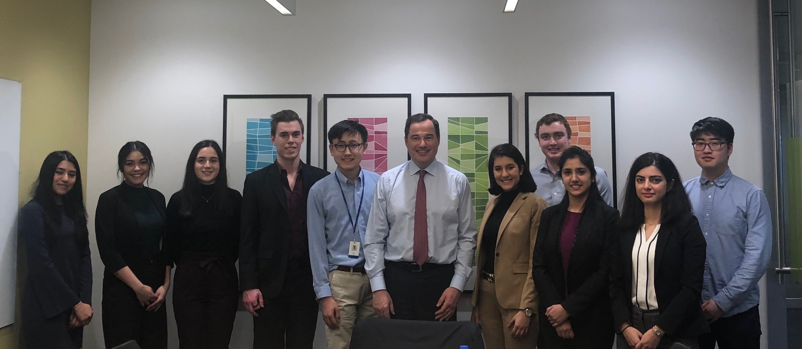

I finished my first co-op term at the end of April. I worked as a TSA (Technical Systems Analyst) in OLB (online banking) at RBC (Royal Bank of Canada) in downtown Toronto. 

This experience has been an amazing eye opener for me into the worlds of software and finance. It's answered a few questions that I've had for a long time.

_Look mom! I had lunch with the RBC Head of T&O!_

## What does a developer do?
My mental image of a software developer has evolved throughout my life.

Having been introduced to programming through high school programming contests, I originally thought that developing meant writing elegant algorithms to complicated math problems. Then I started watching TV Shows like HBO's Silicon Valley — so I began to to think of it as building cool apps. My experience at RBC finally gave me the answer I was looking for.

### Tl; dr
There are three main things that drive development:
1. Customer requirements
2. Business requirements
3. Technical (internal) requirements

There are a few ways changes are made to the codebase:
1. New feature (some new functionality)
2. Refactoring/cleanup (making stuff more efficient and maintainable)
3. Integration (when the stuff your application talks to changes)

My typical day was a 9 AM standup meeting, followed by a few hours of work until lunch. The afternoon sometimes involved meeting other teams to go over projects we were collaborating on or maybe a second standup for a specific feature team. Every two weeks, there'd be a planning meeting.

## How do you work as a developer? Aside from technical knowledge, what's important?
Communication is key. I cannot stress this enough. Communication is what builds your relationship with others — your manager, your team, your customers (internal or external).

You need to be active in reaching out to people. As I kid, I was always quiet and reserved. After working at RBC, I am a changed man. It's important to speak early about any issues you might have — whether it's not being able to meet a deadline, needing to miss a day of work, or objecting to a decision being made. Most people are open and understanding, but even if it doesn't work out the way you wanted it to, having that conversation builds trust. I learned this the hard way, haha.

> You miss 100% of the shots you never take — Wayne Gretzky

I don't know if I'm taking this out of context, but anyway, you get the idea.

## How do you enjoy work?
Go to company events! Take advantage of all the free food and drink!

Seriously, it was an awesome way to bond with coworkers and other co-ops. Hats off the to the co-op team at RBC. You guys do a great job.

I used to be the kind of person to have just gone straight home after work, but I've been changing that. I guess what I'm trying to say is that I'm becoming extroverted? 

## Interesting things I've learned about the industry
* Technology & Operations is the 2nd largest group (number of people) in RBC, after Personal & Commercial Banking
* In tech, it's not uncommon to see people move between seemingly unrelated industries — transferable skills like communication are in many cases more important than technical know-how
* COBOL is still around! There was one project I was working on which had software written in COBOL, C, Java, and Angular. Because of the lack of new developers learning it, COBOL jobs are actually very well-paying. 