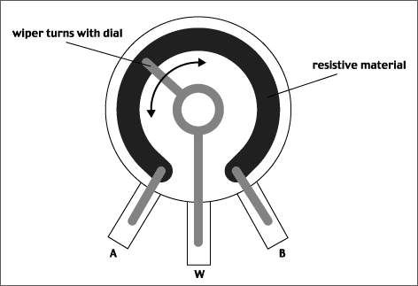
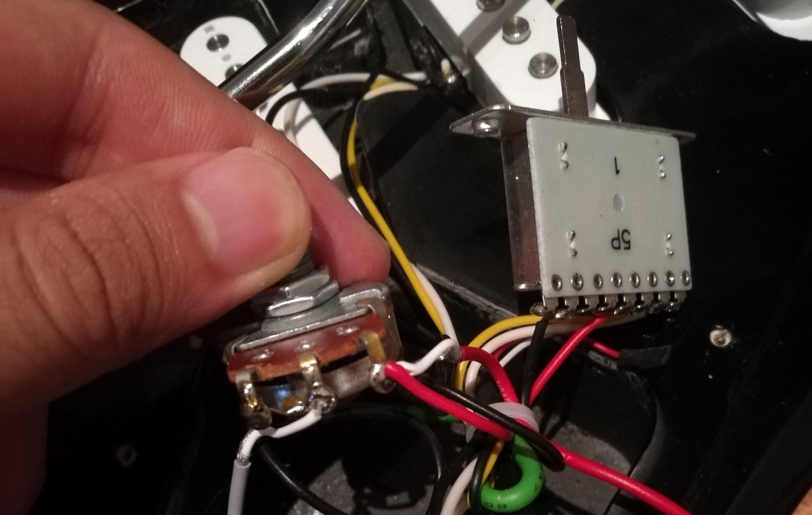
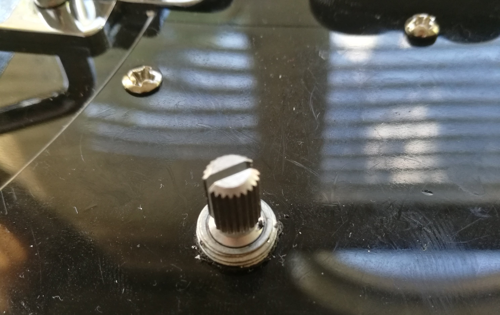
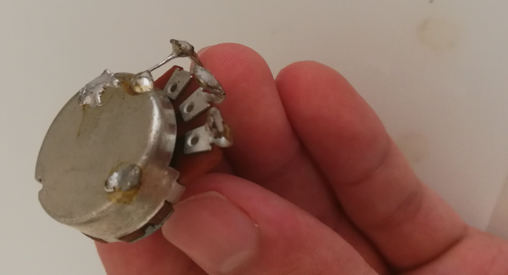

I had a scratchy volume knob on my Sterling by Music Man Silo3 guitar for some time now and I finally got around to replacing it.

### Materials needed
- Guitar
- New potentiometer
- Soldering iron
- Probably a 3rd hand (soldering)
- Solder
- Extra wire

### Step 1: Setup
First check that the scratchiness is not coming from buildup in the potentiometer itself - try spraying the inside of the pot with Deoxit and see if it goes away.

Make sure you pick the right component: a 250k or 500k ohm potentiometer. It doesn't matter _too_ much, but for volume it's better to have a logarithmic taper pot and for tone it's better to have a linear taper pot. For me [this Ernie Ball part](https://www.long-mcquade.com/84686/Guitars/Parts/Ernie-Ball/250K-Split-Shaft-Potentiometer-for-Instruments.htm) (linear taper) worked well.

### Step 1.1: What is a potentiometer?

It's a voltage divider. The signal coming from the pickup is divided. Don't ask me for circuit analysis though, that's some EE magic.

### Step 2: Prepare
Take photos of the circuitry - you'll want know how to put everything back together.

### Step 3: Solder
Typically black indicates ground and red indicates some positive constant DC voltage. That was not the case for me, but use colour codes where you can.

It was fairly straightforward for me to desolder and solder terminal by terminal. If you can't do that, I would suggest rubber bands or twist ties to keep track of which bundle of wires was connected to which terminal.

You may have to wack up the temp on your soldering iron to desolder. I had to go to ~450 celsius.

### Step -1: Improvise. Adapt. Overcome.
The potentiometer I bought had a shaft that was a little too wide, so I "carved off" some of the plastic on the pickguard by rotating some scissors.

It takes some real skill to make a wire out of solder. Also I don't condone using the casing as ground.

