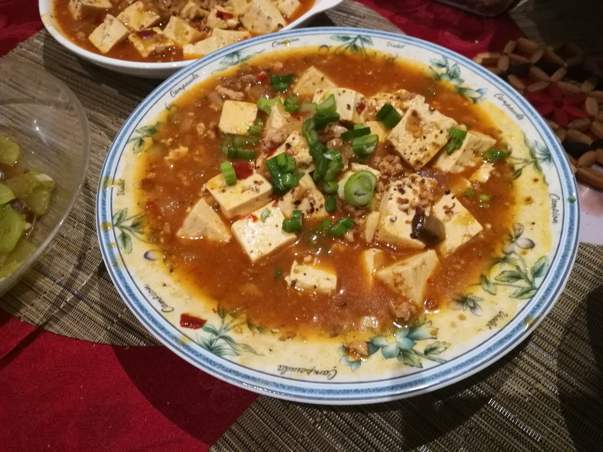
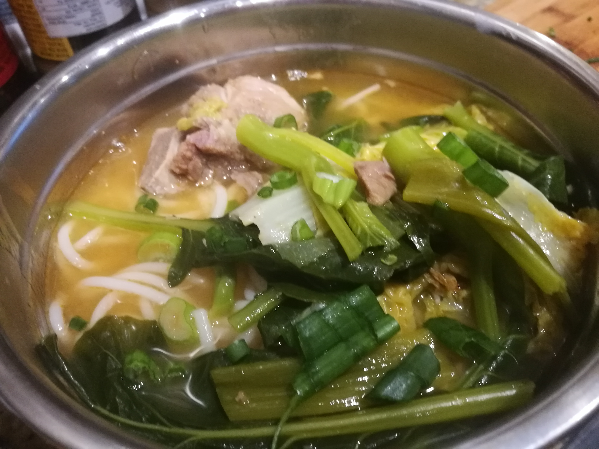
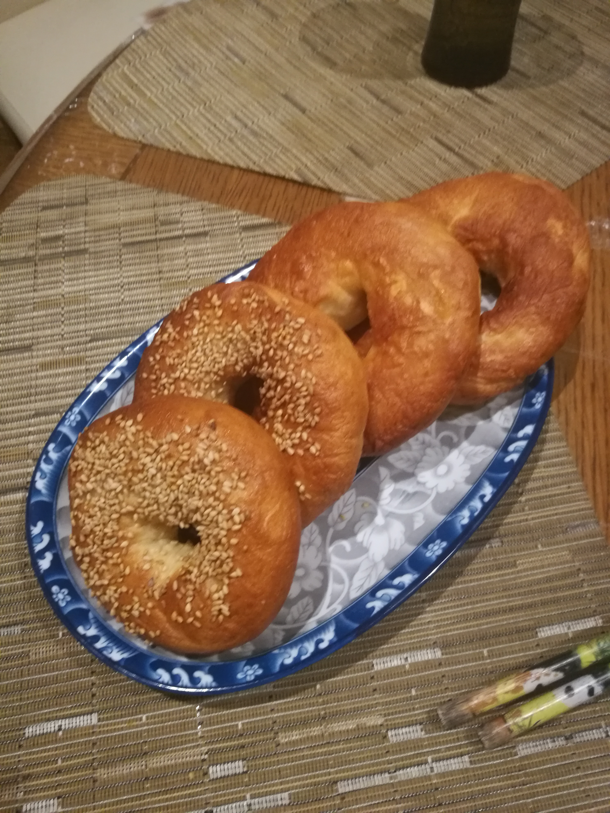

### Here's how I stacked up against my goals
1. Get to 10 pullups in one go\
Not yet\
[Me doing 6 "ok" pulls ups and 2 bad ones](goals/pullups.m4v)

2. Run twice a week\
[Started pretty late but have been fairly consistent](https://www.strava.com/athletes/77016097)

3. [Build pong on my FPGA board](https://github.com/alainlou/pong)

4. Be closer connected and appreciative of my family\
Feel like it, since I've been cooking more for them\
\

5. Bake weekly\
Yes

New goals:
1. Get to 15 pulls in one go (probably that means I'll get to 12)
2. Run 3 times a week
3. Do a 1 to 10 to 1 burpee round
4. Do an FPGA URA
5. Nice to have: try to get term dean's honours so I can graduate with it
