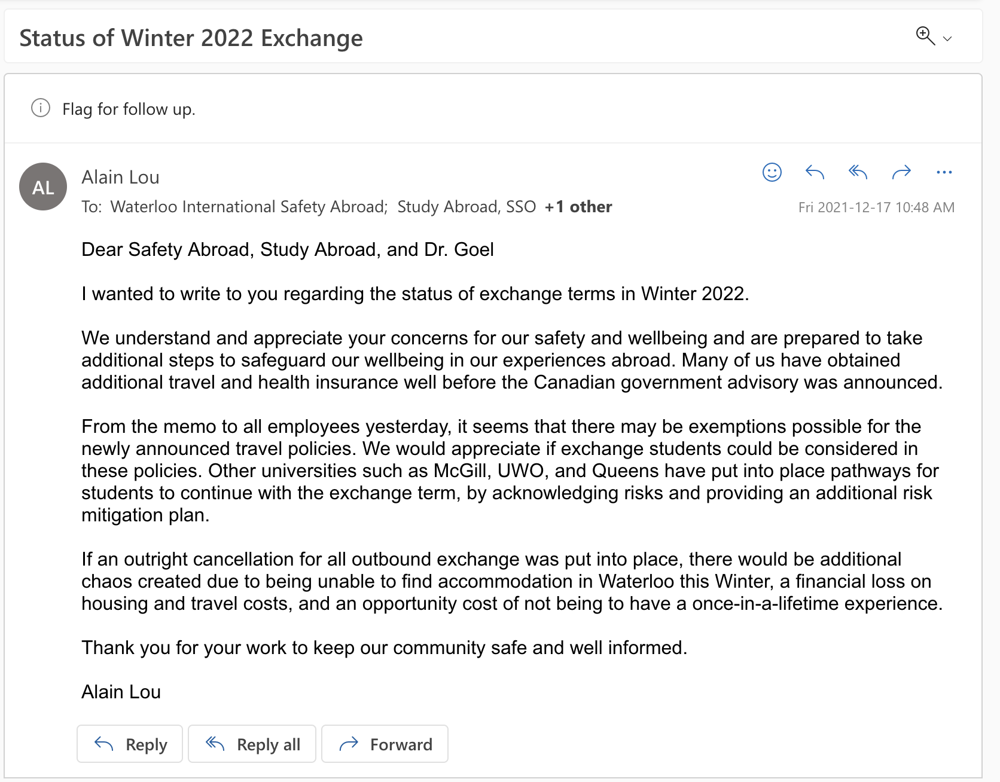

This was originally going to be a part of a huge entry about all of 2022, but I feel like it makes a lot of sense as a separate anecdote/lesson.

---

I had applied in fall 2020 for a study abroad semester at the National University of Singapore in winter 2022. At the time, that was supposed to be my study term for ECE stream 4. In early 2021, the department decided to change the sequence for all ECE students to make winter a co-op term instead. Many of my fellow ECE students, including others bound for NUS, changed their study abroad term according to fall 2021. I requested that the department _not_ change my sequence because:
1.  I wanted to escape the North American winter weather.
2.  I had a lingering suspicion that September 2021 would be too soon for Waterloo to allow study abroad.

It turned out that the second point was unfortunately true. Although NUS accepted exchange students that term, it was only from some small "green list" of countries with low COVID prevalence (China, HK, Macau I believe). This was the first dodged bullet.

During the fall semester, as the exchange term creeped up, we were still in "cautious mode" with COVID-19. The official position from the UWaterloo administration at the start of the term was to continue preparing for exchange to go ahead. I was not ready for the rollercoaster of emotions over the next 4 months from a few emails sent by the study abroad office. Looking back, I'm very thankful to the study abroad office for being flexible and allowing us to go in the end. There was definitely a lot of behind-the-scenes work between Waterloo and NUS to make it all work out as well. For each cancellation, I do believe the office was acting in the students' best interest - at the time it looked like it wouldn't have worked out and they tried to come out with a decision as early as possible to give us time to prepare for the term. For this, I forgive all the times UWaterloo admin has spited me :)
1. In October, exchange was cancelled pre-emptively from the UWaterloo side with the huge Delta wave.
2. A few weeks later, exchange was reinstated when Delta came under control, as long as the host school still allowed for incoming exchange.
3. A few days later, they announced apparently that NUS could not accept us anymore since they were well into the process with course matching, student housing, etc. and that there'd be not enough time for us to get through all of this.
4. A few days later, they said that NUS actually was open. It was indeed late into the application stage. The biggest concern was course matching - if you didn't get slotted into at least 3 courses, you couldn't get accepted by NUS.
> - I haggled with two profs (Dr. Wang Ye and Dr. Massimo Alioto) to get an exception to get into their courses (CS4347 - Sound and Music Computing; EE4415 - Integrated Digital Circuits); for the former I didn't have the prerequisites, for the latter there were no spots left for "non-graduating" (exchange) students. Fortunately profs like keeners so I was overridden into both.
> - Unfortunately not everyone was lucky and we lost a few folks here as well :'(
5. About two weeks before we were due to fly out, the Federal Government of Canada announced that it was advising Canadians to refrain from non-essential travel. In the past, this was the primary reason for cancelled exchange terms (at least through official communication from the University of Waterloo). It seemed that some ugly monster had again reared its head and in the end we still lost. But we all still had the Audacity of Hope. The day after the announcement, the University had sent a broad message to all students and staff to comment on the travel advisory and that it would adjust accordingly. I wrote an email to the President of Waterloo (Vivek Goel), study abroad office, and safety abroad office. **This was perhaps the best email I've written my entire life.**

I don't know if this email helped at all, but I think what mattered was trying. I credit my mom for making me this kind of person. There really is a human at the end of all the bureaucracy and it's always worth it to strive to make what you want to work out.

We were very lucky. Many schools, including U of T, UBC, McMaster, all cancelled their exchange programs in response to the travel advisory. Waterloo did not.

During all of this, one guy in our Facebook group chat for Singapore W22 exchange was coming up with backup plans to have a DIY exchange at NUS or other schools (a Korean university was particularly well suited). He found out there's ways to do a study abroad term without going through your home school study abroad office, which meant that the credits would not necessarily transfer back and it would be more expensive. This still worked out for him since he didn't need the credits to graduate and had some pretty high-paying co-op terms. Fortunately, it was not necessary.
